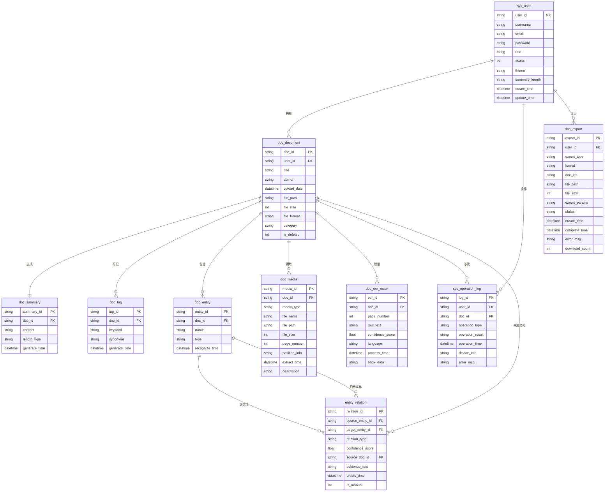
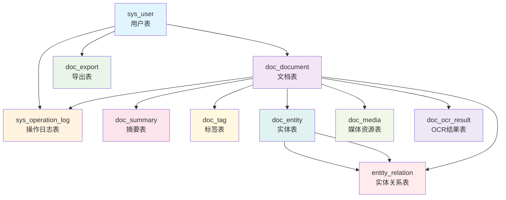

# 文档智能分析系统 - 数据库关系模式

## 📋 概述

本文档描述了文档智能分析系统的完整数据库关系模式。数据库设计支持系统的所有核心功能，包括用户管理、文档管理、内容分析、标签系统、实体识别和导出功能。在新的系统封装中，这些表通过统一的DocumentSystem类进行访问和管理。

## 1. 实体关系图（ER图）

### 1.1 标准Mermaid ER图



### 1.2 简化的关系图（更兼容的版本）



### 1.3 ASCII关系图

```
┌─────────────────┐
│   sys_user      │
│   (用户表)      │
└─────────┬───────┘
          │ 拥有
          ▼
┌─────────────────┐     ┌─────────────────┐     ┌─────────────────┐
│  doc_document   │────▶│   doc_summary   │     │    doc_tag      │
│   (文档表)      │     │   (摘要表)      │     │   (标签表)      │
└─────────┬───────┘     └─────────────────┘     └─────────────────┘
          │                   │ 拥有                 │ 标记
          │ 生成              ▼                      ▼
          │           ┌─────────────────┐     ┌─────────────────┐
          │           │  doc_entity     │     │   doc_media     │
          │           │   (实体表)      │     │  (媒体资源表)   │
          │           └─────────┬───────┘     └─────────────────┘
          │                     │ 包含
          │                     ▼
          │           ┌─────────────────┐
          │           │ entity_relation  │
          │           │  (实体关系表)   │
          │           └─────────────────┘
          │
          ├─▶ ┌─────────────────┐
          │   │doc_ocr_result   │
          │   │ (OCR结果表)     │
          │   └─────────────────┘
          │
          ├─▶ ┌─────────────────┐
          │   │sys_operation_log│
          │   │  (操作日志表)   │
          │   └─────────────────┘
          │
          ▼
┌─────────────────┐
│    doc_export   │
│   (导出表)      │
└─────────────────┘
```

## 2. 表关系详细说明

### 2.1 核心实体关系

#### 用户与文档关系（一对多）
```
sys_user (1) ←→ (N) doc_document
- 一个用户可以上传多个文档
- 每个文档只属于一个用户
- 外键：doc_document.user_id → sys_user.user_id
```

**在新系统中的实现**：
```python
# 在DocumentSystem中
def list_user_documents(self, user_id, **kwargs):
    """列出用户的所有文档"""
    return self.document_service.list_user_documents(user_id, **kwargs)
```

#### 文档与内容关系（一对多）
```
doc_document (1) ←→ (1) doc_summary
- 每个文档只有一个摘要
- 外键：doc_summary.doc_id → doc_document.doc_id

doc_document (1) ←→ (N) doc_tag
- 一个文档可以有多个标签
- 外键：doc_tag.doc_id → doc_document.doc_id

doc_document (1) ←→ (N) doc_entity
- 一个文档可以包含多个实体
- 外键：doc_entity.doc_id → doc_document.doc_id
```

**在新系统中的实现**：
```python
# 获取文档的完整信息（包括摘要、标签、实体）
def get_document_info(self, doc_id):
    """获取文档完整信息"""
    return self.document_service.get_document_info(doc_id)
```

### 2.2 扩展功能关系

#### 文档与媒体资源关系（一对多）
```
doc_document (1) ←→ (N) doc_media
- 一个文档可以提取多个图片/表格
- 外键：doc_media.doc_id → doc_document.doc_id
```

#### 文档与OCR结果关系（一对多）
```
doc_document (1) ←→ (N) doc_ocr_result
- 一个文档每页都有一个OCR结果
- 外键：doc_ocr_result.doc_id → doc_document.doc_id
```

### 2.3 实体关系网络

#### 实体间关系（多对多）
```
doc_entity (1) ←→ (N) entity_relation ←→ (1) doc_entity
- 支持实体间的双向关系
- 外键：entity_relation.source_entity_id → doc_entity.entity_id
- 外键：entity_relation.target_entity_id → doc_entity.entity_id
```

**在新系统中的实现**：
```python
# 获取文档实体
def get_document_entities(self, doc_id):
    """获取文档实体"""
    return self.entity_model.get_entities_by_doc_id(doc_id)
```

### 2.4 操作与日志关系

#### 用户操作日志（一对多）
```
sys_user (1) ←→ (N) sys_operation_log
- 记录用户的所有操作
- 外键：sys_operation_log.user_id → sys_user.user_id

doc_document (1) ←→ (N) sys_operation_log
- 记录文档相关操作
- 外键：sys_operation_log.doc_id → doc_document.doc_id
```

#### 用户导出管理（一对多）
```
sys_user (1) ←→ (N) doc_export
- 管理用户的所有导出任务
- 外键：doc_export.user_id → sys_user.user_id
```

## 3. 关系类型总结

### 3.1 一对一关系 (1:1)
- doc_document ↔ doc_summary：每个文档对应一个摘要

### 3.2 一对多关系 (1:N)
- sys_user → doc_document：用户拥有文档
- sys_user → sys_operation_log：用户操作日志
- sys_user → doc_export：用户导出记录
- doc_document → doc_tag：文档标签
- doc_document → doc_entity：文档实体
- doc_document → doc_media：文档媒体资源
- doc_document → doc_ocr_result：文档OCR结果
- doc_document → sys_operation_log：文档操作日志

### 3.3 多对多关系 (M:N)
- doc_entity ↔ doc_entity（通过entity_relation表）：实体关系网络

## 4. 在新系统中的数据流向分析

### 4.1 主要数据流向
```
用户 → 文档上传 → 内容提取 → 分析处理 → 结果存储
```

### 4.2 详细流程与新系统集成

#### 1. 用户管理流程
```python
# 用户注册
system.register_user(username, email, password, **kwargs)
# → sys_user表插入数据

# 用户登录
system.login_user(username, password)
# → sys_user表验证 + sys_operation_log记录

# 用户资料管理
system.get_user_profile(user_id)
system.update_user_profile(user_id, **kwargs)
# → sys_user表操作
```

#### 2. 文档管理流程
```python
# 文档上传
system.upload_document(user_id, title, author, file_path, **kwargs)
# → doc_document表插入 + sys_operation_log记录

# 文档信息获取
system.get_document_info(doc_id)
# → 联合查询 doc_document + doc_summary + doc_tag + doc_entity

# 文档搜索
system.search_documents(**kwargs)
# → doc_document表搜索 + 标签关联搜索
```

#### 3. 标签管理流程
```python
# 创建标签
system.create_tag(doc_id, keyword, synonyms=None)
# → doc_tag表插入

# 标签搜索
system.search_documents_by_keywords(keywords, match_type='any', limit=50)
# → doc_tag表 + doc_document表联合查询

# 热门标签
system.get_popular_keywords(limit=20)
# → doc_tag表聚合查询
```

#### 4. 统计信息流程
```python
# 用户统计
system.get_user_stats()
# → sys_user表 + doc_document表聚合查询

# 文档统计
system.get_document_stats(user_id=None)
# → doc_document表聚合查询

# 标签统计
system.get_tag_stats()
# → doc_tag表聚合查询
```

## 5. 约束和索引优化

### 5.1 外键约束
- 所有外键都设置了级联删除或空值处理
- 保证数据引用完整性

### 5.2 索引优化策略

#### 主要索引
```sql
-- 用户相关索引
CREATE INDEX idx_user_username ON sys_user(username);
CREATE INDEX idx_user_email ON sys_user(email);
CREATE INDEX idx_user_status ON sys_user(status);

-- 文档相关索引
CREATE INDEX idx_doc_user ON doc_document(user_id);
CREATE INDEX idx_doc_title ON doc_document(title);
CREATE INDEX idx_doc_author ON doc_document(author);
CREATE INDEX idx_doc_category ON doc_document(category);
CREATE INDEX idx_doc_upload_date ON doc_document(upload_date);
CREATE INDEX idx_doc_deleted ON doc_document(is_deleted);

-- 标签相关索引
CREATE INDEX idx_tag_doc ON doc_tag(doc_id);
CREATE INDEX idx_tag_keyword ON doc_tag(keyword);
CREATE INDEX idx_tag_generate_time ON doc_tag(generate_time);

-- 实体相关索引
CREATE INDEX idx_entity_doc ON doc_entity(doc_id);
CREATE INDEX idx_entity_name ON doc_entity(name);
CREATE INDEX idx_entity_type ON doc_entity(type);
CREATE INDEX idx_entity_recognize_time ON doc_entity(recognize_time);

-- 复合索引
CREATE INDEX idx_doc_user_category ON doc_document(user_id, category);
CREATE INDEX idx_tag_keyword_doc ON doc_tag(keyword, doc_id);
```

#### 新系统中的查询优化
```python
# 在DocumentSystem中，查询已经过优化
def search_documents(self, **kwargs):
    """搜索文档 - 已优化的查询"""
    return self.document_service.search_documents(**kwargs)

def search_documents_by_keywords(self, keywords, match_type='any', limit=50):
    """关键词搜索 - 使用索引优化"""
    return self.tag_model.search_documents_by_keywords(keywords, match_type, limit)
```

## 6. 扩展性设计

### 6.1 水平扩展
- 支持按用户分库分表
- 支持文档存储的分布式架构

### 6.2 垂直扩展
- 实体关系表支持复杂的图谱扩展
- 导出表支持多种格式的动态扩展

### 6.3 新系统中的扩展性
```python
# DocumentSystem支持配置化扩展
system = create_document_system(db_config)

# 可以轻松添加新的功能模块
class EnhancedDocumentSystem(DocumentSystem):
    def __init__(self, db_config=None):
        super().__init__(db_config)
        # 添加新的服务或模型
        self.new_service = NewService()
    
    def new_functionality(self, **kwargs):
        """新增功能"""
        return self.new_service.do_something(**kwargs)
```

## 7. 数据完整性保证

### 7.1 事务处理
在新系统中，所有关键操作都使用事务保证数据一致性：

```python
# 示例：文档上传事务
def upload_document_with_transaction(self, user_id, title, author, file_path, **kwargs):
    """带事务的文档上传"""
    try:
        with self.db.get_connection() as conn:
            with conn.cursor() as cursor:
                # 开始事务
                conn.begin()
                
                # 1. 插入文档记录
                doc_id = self.document_model.create_document(...)
                
                # 2. 记录操作日志
                self.log_operation(user_id, doc_id, 'upload', 'success')
                
                # 提交事务
                conn.commit()
                return doc_id
    except Exception as e:
        conn.rollback()
        raise e
```

### 7.2 数据验证
```python
# 在DocumentSystem中进行数据验证
def register_user(self, username, email, password, **kwargs):
    """用户注册 - 包含数据验证"""
    # 1. 基础验证
    if not username or not email or not password:
        return {'success': False, 'message': '必填字段不能为空'}
    
    # 2. 唯一性验证
    if self.user_model.get_user_by_username(username):
        return {'success': False, 'message': '用户名已存在'}
    
    # 3. 委托给服务层
    return self.user_service.register_user(username, email, password, **kwargs)
```

## 8. 性能优化建议

### 8.1 查询优化
- 使用复合索引优化常用查询
- 分页查询避免大结果集
- 使用连接查询减少数据库往返

### 8.2 缓存策略
- 元数据缓存（表结构、字段信息）
- 用户会话缓存
- 热门数据缓存

### 8.3 新系统中的性能优化
```python
# 在DocumentSystem中实现缓存
from functools import lru_cache

class OptimizedDocumentSystem(DocumentSystem):
    def __init__(self, db_config=None):
        super().__init__(db_config)
        self._cache = {}
    
    @lru_cache(maxsize=1000)
    def get_document_info_cached(self, doc_id):
        """带缓存的文档信息获取"""
        return self.get_document_info(doc_id)
    
    def clear_cache(self):
        """清除缓存"""
        self.get_document_info_cached.cache_clear()
```

## 9. 监控和维护

### 9.1 数据库监控
- 连接数监控
- 查询性能监控
- 慢查询日志分析

### 9.2 数据维护
- 定期数据备份
- 日志清理策略
- 索引重建

### 9.3 新系统中的监控
```python
# 在DocumentSystem中添加监控功能
class MonitoredDocumentSystem(DocumentSystem):
    def __init__(self, db_config=None):
        super().__init__(db_config)
        self.query_count = 0
        self.error_count = 0
    
    def _execute_with_monitoring(self, query_func, *args, **kwargs):
        """带监控的查询执行"""
        try:
            self.query_count += 1
            result = query_func(*args, **kwargs)
            return result
        except Exception as e:
            self.error_count += 1
            raise e
    
    def get_stats(self):
        """获取系统统计"""
        return {
            'query_count': self.query_count,
            'error_count': self.error_count,
            'success_rate': (self.query_count - self.error_count) / max(self.query_count, 1)
        }
```

---

## 📝 总结

新的数据库关系模式完全支持文档智能分析系统的所有功能需求，通过DocumentSystem类的统一封装，提供了：

1. **完整的功能覆盖**：支持用户管理、文档管理、内容分析等所有核心功能
2. **优化的查询性能**：通过合理的索引设计和查询优化
3. **数据完整性保证**：通过事务处理和数据验证
4. **良好的扩展性**：支持水平扩展和功能扩展
5. **便于维护**：清晰的表结构和完善的文档

该设计为系统的长期稳定运行和功能扩展提供了坚实的数据基础。

---

*最后更新: 2025年12月*
