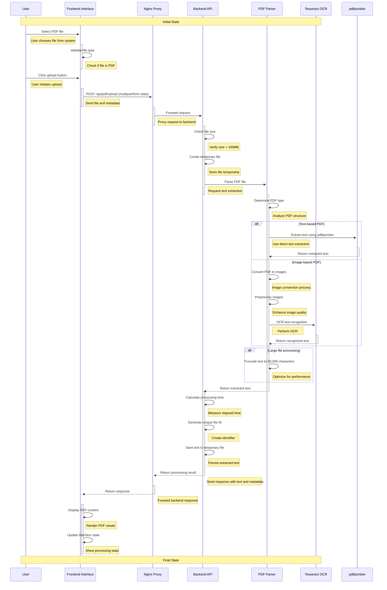
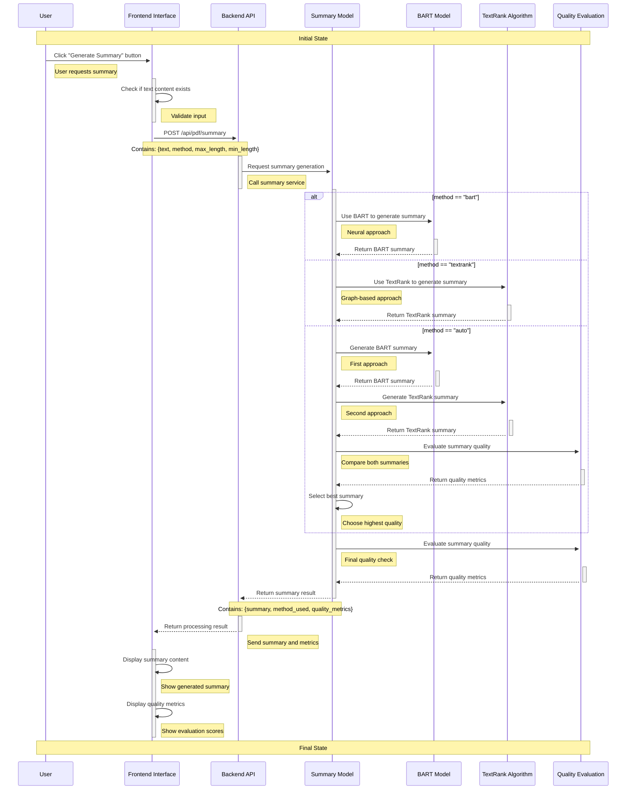
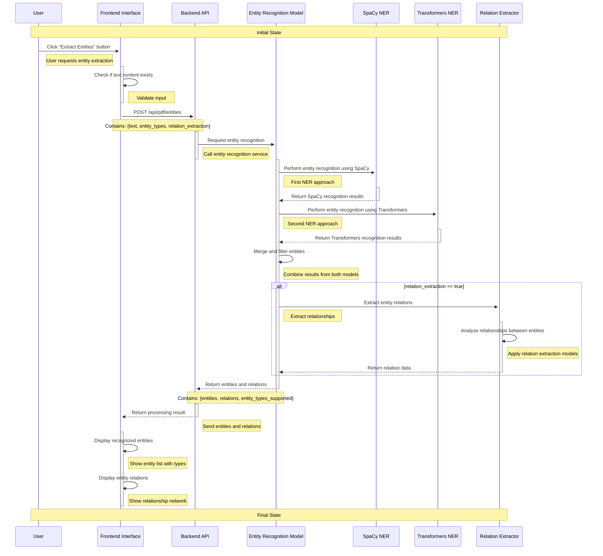
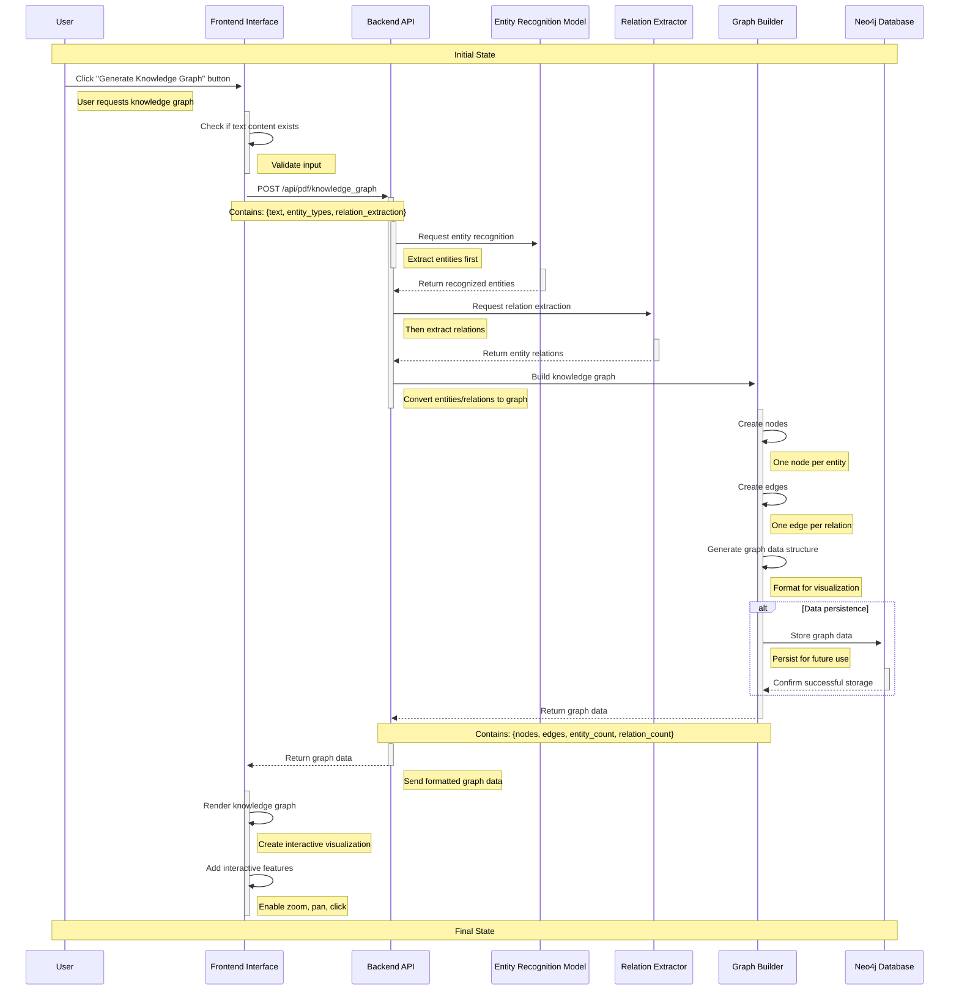
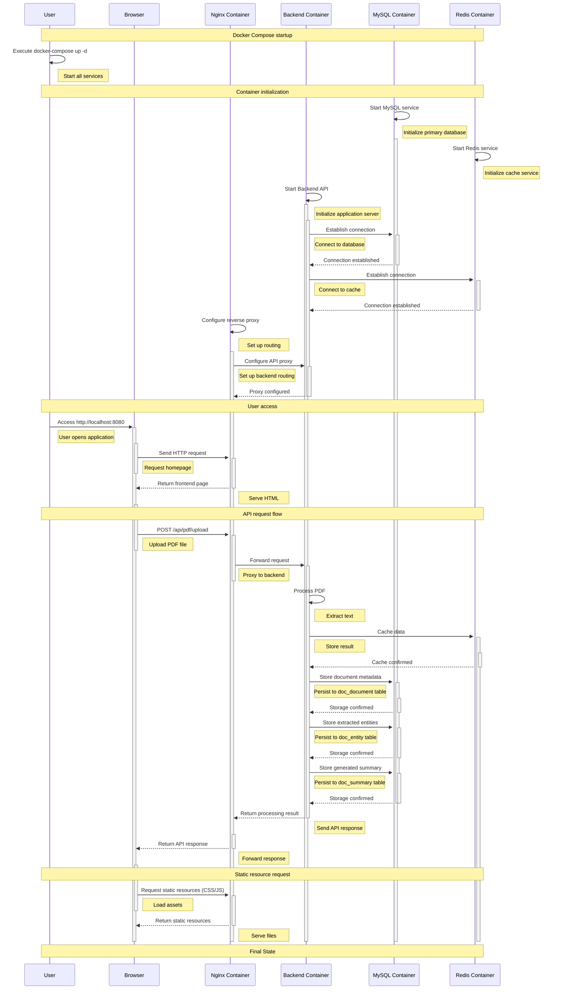

# PDF Processing and NLP Analysis System - Sequence Diagrams with Lifelines

This document contains sequence diagrams with enhanced lifelines for various core modules of the system, demonstrating interaction flows and state changes between different components over time.

## 1. PDF Processing and Text Extraction Sequence Diagram with Lifelines

## 2. Summary Generation Module Sequence Diagram with Lifelines

## 3. Entity Recognition Module Sequence Diagram with Lifelines

## 4. Knowledge Graph Generation Module Sequence Diagram with Lifelines

## 5. Frontend-Backend Interaction System Sequence Diagram with Lifelines

```mermaid
sequenceDiagram
    participant User as User
    participant Frontend as Frontend Interface
    participant Nginx as Nginx Proxy
    participant Backend as Backend API
    participant MySQL as MySQL Database
    participant Redis as Redis Cache
    
    Note over User,Redis: System startup
    Backend->>+Backend: Initialize backend service
    Note right of Backend: Start application
    activate Backend
    
    Backend->>+MySQL: Connect to MySQL database
    Note right of Backend: Initialize primary database connection
    activate MySQL
    MySQL-->>-Backend: Connection established
    
    Backend->>+Redis: Connect to Redis cache
    Note right of Backend: Initialize cache connection
    activate Redis
    Redis-->>-Backend: Connection established
    deactivate Backend
    
    Note over User,Redis: PDF upload and processing flow
    User->>+Frontend: Access application homepage
    Note right of User: User opens browser
    activate Frontend
    
    Frontend->>+Nginx: Request static resources
    Note right of Frontend: Load HTML/CSS/JS
    deactivate Frontend
    activate Nginx
    Nginx-->>-Frontend: Return HTML/CSS/JS
    
    User->>Frontend: Select and upload PDF file
    Note right of User: User interacts with UI
    
    Frontend->>+Nginx: POST /api/pdf/upload
    Note right of Frontend: Send file for processing
    deactivate Frontend
    Nginx->>+Backend: Forward request
    Note right of Nginx: Proxy to backend
    deactivate Nginx
    
    Backend->>+Backend: Process PDF file
    Note right of Backend: Extract text
    activate Backend
    Backend->>+Redis: Cache processing result
    Note right of Backend: Store for future use
    activate Redis
    Redis-->>-Backend: Cache confirmed
    
    Backend-->>-Nginx: Return extracted text
    Note right of Backend: Send text and metadata
    activate Nginx
    Nginx-->>-Frontend: Return processing result
    Note right of Nginx: Forward response
    activate Frontend
    
    Note over User,Redis: Summary generation flow
    User->>Frontend: Click generate summary
    Note right of User: User requests summary
    
    Frontend->>+Nginx: POST /api/pdf/summary
    Note right of Frontend: Send text for summarization
    deactivate Frontend
    Nginx->>+Backend: Forward request
    Note right of Nginx: Proxy to backend
    deactivate Nginx
    
    Backend->>+Backend: Check cache
    Note right of Backend: Look for existing summary
    activate Backend
    Backend->>+Redis: Check cache
    Note right of Backend: Look for existing summary
    activate Redis
    
    alt Cache exists
        Redis-->>Backend: Return cached result
        Note right of Redis: Found in cache
    else Cache not exists
        Redis-->>Backend: No cache found
        Note right of Redis: Cache miss
        Backend->>Backend: Generate summary
        Note right of Backend: Create new summary
        Backend->>Redis: Cache result
        Note right of Backend: Store for future
    end
    deactivate Redis
    
    Backend-->>-Nginx: Return summary result
    Note right of Backend: Send summary and metrics
    activate Nginx
    Nginx-->>-Frontend: Return processing result
    Note right of Nginx: Forward response
    activate Frontend
    
    Note over User,Redis: Knowledge graph generation flow
    User->>Frontend: Click generate knowledge graph
    Note right of User: User requests knowledge graph
    
    Frontend->>+Nginx: POST /api/pdf/knowledge_graph
    Note right of Frontend: Send text for graph generation
    deactivate Frontend
    Nginx->>+Backend: Forward request
    Note right of Nginx: Proxy to backend
    deactivate Nginx
    
    Backend->>+Backend: Recognize entities and relations
    Note right of Backend: Extract graph data
    activate Backend
    
    Backend->>+MySQL: Store entities to doc_entity table
    Note right of Backend: Persist entities in database
    activate MySQL
    MySQL-->>-Backend: Storage confirmed
    
    Backend->>+MySQL: Store relations to entity_relation table
    Note right of Backend: Persist relations in database
    MySQL-->>-Backend: Storage confirmed
    deactivate MySQL
    
    Backend-->>-Nginx: Return graph data
    Note right of Backend: Send nodes and edges
    activate Nginx
    Nginx-->>-Frontend: Return processing result
    Note right of Nginx: Forward response
    activate Frontend
    
    Frontend->>Frontend: Render knowledge graph
    Note right of Frontend: Create visualization
    
    Note over User,Redis: User interaction
    User->>Frontend: Interact with knowledge graph
    Note right of User: User clicks nodes, zooms
    Frontend->>Frontend: Update graph view
    Note right of Frontend: Show selected details
    
    deactivate Frontend
    Note over User,Redis: Final State
```

## 6. Docker Deployment Architecture Sequence Diagram with Lifelines

```mermaid
erDiagram
    sys_user {
        varchar(32) user_id PK "唯一用户ID（UUID生成）"
        varchar(50) username UK "用户名（不可重复）"
        varchar(100) email UK "登录账号（邮箱格式）"
        varchar(128) password "密码"
        varchar(20) role "用户角色：普通用户/科研人员/教师/管理员"
        tinyint status "账号状态：1-正常，0-禁用"
        varchar(20) theme "界面主题：light-日间，dark-夜间"
        varchar(10) summary_length "摘要长度偏好：short/medium/long"
        datetime create_time "注册时间"
        datetime update_time "最后修改时间"
    }

    doc_document {
        varchar(32) doc_id PK "唯一文档ID（UUID生成）"
        varchar(32) user_id FK "所属用户ID（关联sys_user.user_id）"
        varchar(255) title "文档标题（解析自PDF或用户修改）"
        varchar(255) author "文档作者（解析自PDF）"
        datetime upload_date "上传时间"
        varchar(512) file_path "文档存储路径（云端URL或本地路径）"
        bigint file_size "文档大小（单位：字节）"
        varchar(10) file_format "文档格式（仅支持PDF）"
        varchar(50) category "文档分类（用户自定义：如课程论文/科研文献）"
        tinyint is_deleted "逻辑删除：0-未删除，1-已删除"
    }

    doc_summary {
        varchar(32) summary_id PK "唯一摘要ID（UUID生成）"
        varchar(32) doc_id UK "关联文档ID（关联doc_document.doc_id）"
        text content "摘要内容（若过长可存文件，此处存核心摘要）"
        varchar(10) length_type "摘要长度类型：short/medium/long"
        datetime generate_time "生成时间"
    }

    doc_tag {
        varchar(32) tag_id PK "唯一标签ID（UUID生成）"
        varchar(32) doc_id FK "关联文档ID（关联doc_document.doc_id）"
        varchar(50) tag_name "标签名称"
        varchar(20) tag_type "标签类型：keyword（关键词）/category（分类）"
        datetime create_time "创建时间"
    }

    doc_entity {
        varchar(32) entity_id PK "唯一实体ID（UUID生成）"
        varchar(32) doc_id FK "关联文档ID（关联doc_document.doc_id）"
        varchar(255) name "实体名称"
        varchar(50) type "实体类型：algorithm/model/dataset/metric/task/method/person/organization/location/date/other"
        datetime recognize_time "创建时间"
    }

    entity_relation {
        varchar(32) relation_id PK "唯一关系ID（UUID生成）"
        varchar(32) source_entity_id FK "源实体ID（关联doc_entity.entity_id）"
        varchar(32) target_entity_id FK "目标实体ID（关联doc_entity.entity_id）"
        varchar(50) relation_type "关系类型：uses/improves/compares/based_on/evaluates_on/other"
        decimal(43) confidence "关系置信度（0-1）"
        datetime create_time "创建时间"
    }

    doc_media {
        varchar(32) media_id PK "唯一媒体ID（UUID生成）"
        varchar(32) doc_id FK "关联文档ID（关联doc_document.doc_id）"
        varchar(20) media_type "媒体类型：image/table"
        varchar(512) file_path "媒体文件存储路径"
        int page_number "所在PDF页码"
        text caption "媒体标题/描述"
        datetime create_time "创建时间"
    }

    doc_ocr_result {
        varchar(32) ocr_id PK "唯一OCR记录ID（UUID生成）"
        varchar(32) doc_id FK "关联文档ID（关联doc_document.doc_id）"
        int page_number "PDF页码"
        longtext text_content "OCR识别的文本内容"
        decimal(43) confidence "识别置信度（0-1）"
        json bounding_box "文本区域坐标（JSON格式：{x, y, width, height}）"
        datetime create_time "创建时间"
    }

    sys_operation_log {
        varchar(32) log_id PK "唯一日志ID（UUID生成）"
        varchar(32) user_id FK "操作用户ID（关联sys_user.user_id）"
        varchar(32) doc_id FK "关联文档ID（关联doc_document.doc_id）"
        varchar(20) operation_type "操作类型：upload/export/annotate/delete/view/edit"
        datetime operation_time "操作时间"
        varchar(45) ip_address "操作IP地址"
        json details "操作详情（JSON格式）"
    }

    doc_export {
        varchar(32) export_id PK "唯一导出记录ID（UUID生成）"
        varchar(32) doc_id FK "关联文档ID（关联doc_document.doc_id）"
        varchar(32) user_id FK "导出用户ID（关联sys_user.user_id）"
        varchar(20) export_type "导出类型：graph/summary/tags/full"
        varchar(10) export_format "导出格式：json/csv/txt/pdf"
        varchar(512) file_path "导出文件存储路径"
        datetime export_time "导出时间"
        varchar(20) status "导出状态：pending/processing/completed/failed"
    }

    sys_field_metadata {
        int field_id PK "字段元数据ID"
        varchar(50) table_name "所属表名"
        varchar(50) field_name "字段名"
        varchar(100) field_label "字段中文标签"
        varchar(20) field_type "字段类型：text/number/date/select/boolean"
        tinyint is_required "是否必填：0-否，1-是"
        tinyint is_visible "是否显示：0-否，1-是"
        tinyint is_editable "是否可编辑：0-否，1-是"
        int display_order "显示顺序"
        varchar(255) default_value "默认值"
        json options "选项列表（JSON格式，用于select类型）"
        json validation_rules "验证规则（JSON格式）"
        datetime create_time "创建时间"
        datetime update_time "更新时间"
    }

    sys_table_metadata {
        int table_id PK "表元数据ID"
        varchar(50) table_name UK "表名"
        varchar(100) table_label "表中文名"
        text description "表描述"
        tinyint is_system "是否系统表：0-否，1-是"
        datetime create_time "创建时间"
        datetime update_time "更新时间"
    }

    %% ========== 关系 ==========
    sys_user ||--o{ doc_document : "1-N"
    sys_user ||--o{ sys_operation_log : "1-N"
    sys_user ||--o{ doc_export : "1-N"

    doc_document ||--o{ doc_summary : "1-1"
    doc_document ||--o{ doc_tag : "1-N"
    doc_document ||--o{ doc_entity : "1-N"
    doc_document ||--o{ doc_media : "1-N"
    doc_document ||--o{ doc_ocr_result : "1-N"

    doc_entity ||--o{ entity_relation : "1-N（source）"
    doc_entity ||--o{ entity_relation : "1-N（target）"

    sys_table_metadata ||--o{ sys_field_metadata : "1-N"
```

## Summary

The sequence diagrams above demonstrate interaction flows with enhanced lifelines that clearly show:

1. **Activation/Deactivation**: Explicit activation and deactivation of components during their active processing periods
2. **State Annotations**: Notes that explain what each component is doing at different stages
3. **Temporal Flow**: Clear vertical time flow showing the progression of operations
4. **State Transitions**: Clear distinction between initial state, processing states, and final state
5. **Detailed Steps**: Each significant operation is annotated with explanatory notes

These enhanced lifelines make it easier to understand:
- When each component is actively processing
- What specific operations each component performs
- How long each component is engaged in the process
- The flow of control and data between components
- The overall system behavior over time

This detailed view is particularly useful for understanding complex workflows and identifying potential bottlenecks or optimization opportunities in the system.

## 7. SQL Database Integration Sequence Diagram with Lifelines

```mermaid
sequenceDiagram
    participant User as User
    participant Frontend as Frontend Interface
    participant Backend as Backend API
    participant DBIntegration as Database Integration
    participant MySQL as MySQL Database
    participant DocumentService as Document Service
    participant EntityModel as Entity Model
    participant SummaryModel as Summary Model
    participant TagModel as Tag Model
    
    Note over User,TagModel: PDF Processing and Storage Workflow
    User->>+Frontend: Upload PDF file
    Note right of User: User initiates upload
    activate Frontend
    Frontend->>+Backend: POST /api/pdf/process_and_store
    Note right of Frontend: Send file for processing and storage
    deactivate Frontend
    activate Backend
    
    Backend->>+Backend: Extract PDF text
    Note right of Backend: Parse PDF content
    Backend->>+DBIntegration: Initialize database integration
    Note right of Backend: Prepare for database storage
    activate DBIntegration
    
    DBIntegration->>+DocumentService: Create document record
    Note right of DBIntegration: Store document metadata
    activate DocumentService
    DocumentService->>+MySQL: INSERT INTO doc_document
    Note right of DocumentService: Store document info
    activate MySQL
    MySQL-->>-DocumentService: Return doc_id
    deactivate MySQL
    DocumentService-->>-DBIntegration: Return document result
    deactivate DocumentService
    
    Note over User,TagModel: Entity Extraction and Storage
    Backend->>Backend: Extract entities from text
    Note right of Backend: NLP entity recognition
    DBIntegration->>+EntityModel: Store recognized entities
    Note right of DBIntegration: Persist entities
    activate EntityModel
    EntityModel->>+MySQL: INSERT INTO doc_entity
    Note right of EntityModel: Store entity data
    activate MySQL
    MySQL-->>-EntityModel: Confirm entity storage
    deactivate MySQL
    EntityModel-->>-DBIntegration: Return entity storage result
    deactivate EntityModel
    
    Note over User,TagModel: Relationship Extraction and Storage
    Backend->>Backend: Extract entity relationships
    Note right of Backend: NLP relation extraction
    DBIntegration->>+EntityModel: Store entity relations
    Note right of DBIntegration: Persist relationships
    activate EntityModel
    EntityModel->>+MySQL: INSERT INTO entity_relation
    Note right of EntityModel: Store relation data
    activate MySQL
    MySQL-->>-EntityModel: Confirm relation storage
    deactivate MySQL
    EntityModel-->>-DBIntegration: Return relation storage result
    deactivate EntityModel
    
    Note over User,TagModel: Summary Generation and Storage
    Backend->>Backend: Generate document summary
    Note right of Backend: NLP summarization
    DBIntegration->>+SummaryModel: Store generated summary
    Note right of DBIntegration: Persist summary
    activate SummaryModel
    SummaryModel->>+MySQL: INSERT INTO doc_summary
    Note right of SummaryModel: Store summary data
    activate MySQL
    MySQL-->>-SummaryModel: Confirm summary storage
    deactivate MySQL
    SummaryModel-->>-DBIntegration: Return summary storage result
    deactivate SummaryModel
    
    Note over User,TagModel: Tag Generation and Storage
    Backend->>Backend: Extract tags/keywords
    Note right of Backend: NLP keyword extraction
    DBIntegration->>+TagModel: Store document tags
    Note right of DBIntegration: Persist tags
    activate TagModel
    TagModel->>+MySQL: INSERT INTO doc_tag
    Note right of TagModel: Store tag data
    activate MySQL
    MySQL-->>-TagModel: Confirm tag storage
    deactivate MySQL
    TagModel-->>-DBIntegration: Return tag storage result
    deactivate TagModel
    
    Note over User,TagModel: Finalize Processing
    DBIntegration->>DBIntegration: Aggregate processing results
    Note right of DBIntegration: Combine all storage results
    DBIntegration-->>-Backend: Return complete processing result
    Note right of DBIntegration: Include doc_id and storage status
    deactivate DBIntegration
    
    Backend-->>-Frontend: Return processing result
    Note right of Backend: Send doc_id and processing details
    activate Frontend
    
    Frontend->>Frontend: Display processing results
    Note right of Frontend: Show doc_id and status
    deactivate Frontend
    Note over User,TagModel: Final State
    
    Note over User,TagModel: Document Retrieval Workflow
    User->>+Frontend: Request document details
    Note right of User: User wants to view document
    activate Frontend
    Frontend->>+Backend: GET /api/pdf/document/{doc_id}
    Note right of Frontend: Request document information
    deactivate Frontend
    activate Backend
    
    Backend->>+DBIntegration: Get document with all details
    Note right of Backend: Request complete document info
    activate DBIntegration
    
    DBIntegration->>+DocumentService: Get document metadata
    Note right of DBIntegration: Fetch basic document info
    activate DocumentService
    DocumentService->>+MySQL: SELECT FROM doc_document
    Note right of DocumentService: Get document data
    activate MySQL
    MySQL-->>-DocumentService: Return document data
    deactivate MySQL
    DocumentService-->>-DBIntegration: Return document info
    deactivate DocumentService
    
    DBIntegration->>+EntityModel: Get document entities
    Note right of DBIntegration: Fetch related entities
    activate EntityModel
    EntityModel->>+MySQL: SELECT FROM doc_entity
    Note right of EntityModel: Get entity data
    activate MySQL
    MySQL-->>-EntityModel: Return entity data
    deactivate MySQL
    EntityModel-->>-DBIntegration: Return entities
    deactivate EntityModel
    
    DBIntegration->>+SummaryModel: Get document summary
    Note right of DBIntegration: Fetch generated summary
    activate SummaryModel
    SummaryModel->>+MySQL: SELECT FROM doc_summary
    Note right of SummaryModel: Get summary data
    activate MySQL
    MySQL-->>-SummaryModel: Return summary data
    deactivate MySQL
    SummaryModel-->>-DBIntegration: Return summary
    deactivate SummaryModel
    
    DBIntegration->>+TagModel: Get document tags
    Note right of DBIntegration: Fetch related tags
    activate TagModel
    TagModel->>+MySQL: SELECT FROM doc_tag
    Note right of TagModel: Get tag data
    activate MySQL
    MySQL-->>-TagModel: Return tag data
    deactivate MySQL
    TagModel-->>-DBIntegration: Return tags
    deactivate TagModel
    
    DBIntegration->>DBIntegration: Aggregate all document data
    Note right of DBIntegration: Combine into complete document
    DBIntegration-->>-Backend: Return complete document info
    deactivate DBIntegration
    
    Backend-->>-Frontend: Return document data
    Note right of Backend: Send complete document info
    activate Frontend
    
    Frontend->>Frontend: Display document details
    Note right of Frontend: Show metadata, entities, summary, tags
    deactivate Frontend
    Note over User,TagModel: Final State
```

